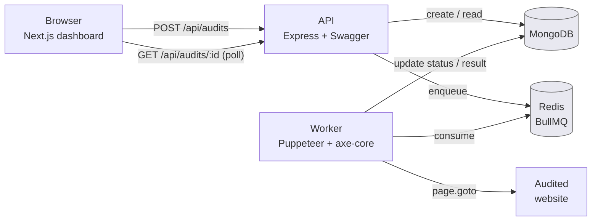
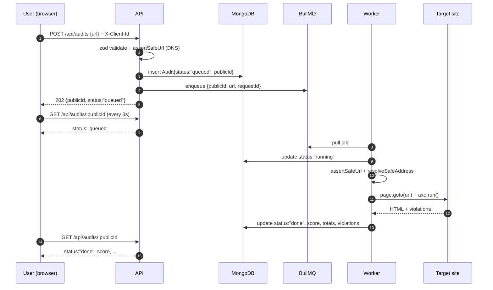

# Notes on the design

A few notes on how this is put together, mostly for my own future self.

## Deployment topology



## Audit lifecycle



## Two processes, two images

`api` (`backend/Dockerfile`) is a slim Node image with no Chromium — the API
never launches a browser. `worker` (`backend/Dockerfile.worker`) is built on
the official `puppeteer/puppeteer` image, which ships its own Chrome and a
non-root `pptruser`. Splitting the images keeps the API surface small (no
chromium binaries on the public-facing container) and lets the two scale
independently.

## Folders

I went with a clean-architecture layout because I wanted `domain/` to stay pure
(no Mongo, no Redis, no Chromium) so I could unit-test scoring and the URL
classifier without booting anything. If I ever swap Puppeteer for Playwright or
BullMQ for SQS, only `infrastructure/` should move.

## Auth

There is no login. Every browser mints a UUID on first load and sends it as
`X-Client-Id`. That header scopes the "my audits" list. Audit reports
themselves are public by `publicId` (a UUID) so they can be shared by URL.

If this ever needs real accounts, that header gets replaced by a session and
nothing else changes.

## Error envelope

```json
{
  "error": { "code": "unsafe_target", "message": "unsafe_target" },
  "requestId": "0b4d2f1e-..."
}
```

`requestId` is set by middleware, returned in `X-Request-Id`, propagated into
the BullMQ job, and attached to every log line the worker emits. With one id
you get the full HTTP-to-worker trail.

## SSRF + DNS rebinding

The worker opens user-supplied URLs in a real browser, so the SSRF
defense is layered:

1. `domain/urlSafety` classifies any IP, allowing only public unicast.
2. `application/assertSafeUrl` resolves DNS at intake and rejects if any
   resolved address is non-public.
3. Worker calls `assertSafeUrl` again before navigation and
   `application/resolveSafeAddress` to pin the IP we'd accept (defense
   against the host flipping to a private IP between intake and connect).
4. A Puppeteer request interceptor classifies every subrequest with
   `application/subrequestPolicy` and aborts anything whose hostname is
   a literal private IP. This catches HTTP redirects to private targets
   that DNS validation alone would not see.

Each layer is unit-tested independently. See `docs/runbooks/dns-rebinding-incident.md`
for the on-call response.

## Observability

- **Logs:** structured JSON via pino. Every line carries the
  `requestId` set by the api's middleware. The api passes it into the
  BullMQ job payload, so worker logs for the same submission share the
  id.
- **Metrics:** prom-client. The api exposes `/metrics` on the public
  port; the worker exposes `:9100/metrics` privately. Names follow the
  Prometheus convention (`http_request_duration_seconds`,
  `audit_duration_seconds`, `audit_failure_total{reason}`,
  `puppeteer_browser_relaunch_total`, `audit_queue_depth{status}`).
  Both processes also export a default node metric set under `node_*`.
- **SLOs:** see `docs/SLO.md`. The four defined objectives cover audit
  duration, api availability, audit failure rate, and queue lag.

## Reliability

- Puppeteer crashes: a `disconnected` listener nulls the cached browser; the
  next job relaunches it (counted by `puppeteer_browser_relaunch_total`).
- Page hangs: `AUDIT_TIMEOUT_MS` on `page.goto`.
- Worker dies mid-job: BullMQ's visibility timeout re-queues the job.
- Redeploy mid-job: `SIGTERM` drains in-flight jobs, then force-closes after
  25s and lets BullMQ re-queue whatever did not finish.
- API redeploy: `SIGTERM` calls `server.close()`, then disconnects mongoose
  and quits the Redis connection within the same 25s window.
- Mongo / Redis / queue down at boot: `/ready` flips to 503 so the load
  balancer stops routing, but `/health` stays 200 so the orchestrator
  does not restart the container in a loop. `/ready` checks all three
  (Mongo, Redis, BullMQ) to avoid the false-healthy when Redis is up
  but BullMQ is wedged.
